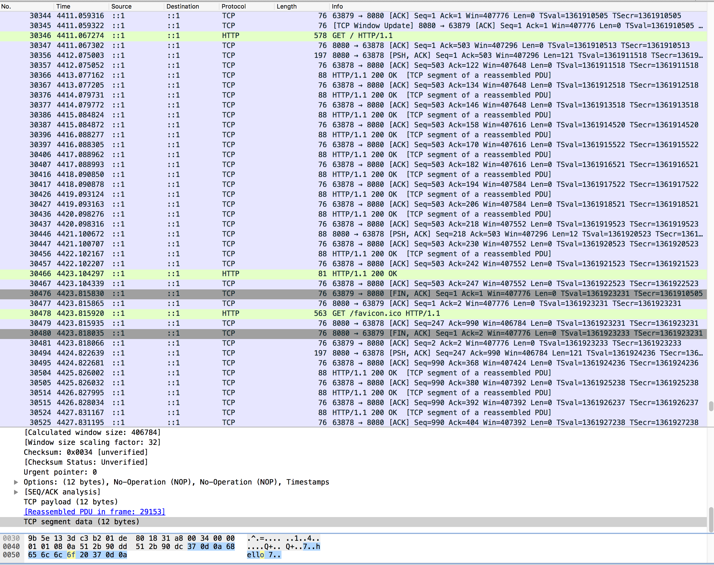

我对 res.write这个方案感到困惑，究竟是
- write的信息都被缓存，res.end() 之后才发送
- 一遍write，一遍发送tcp报文
- write到一定长度，就开始发送

测试方案: 通过setIntervar 慢慢的调用 write.

## 结果
哇，结果挺神奇的。
- 每次write一下，就会返回一个TCP报文。
- 每个tcp segment都会收到客户端的确认报文
- 因为设置了延迟，所以wireshark每一秒钟跳一下
- chrome完全收到报文(10s)后才开始渲染。
